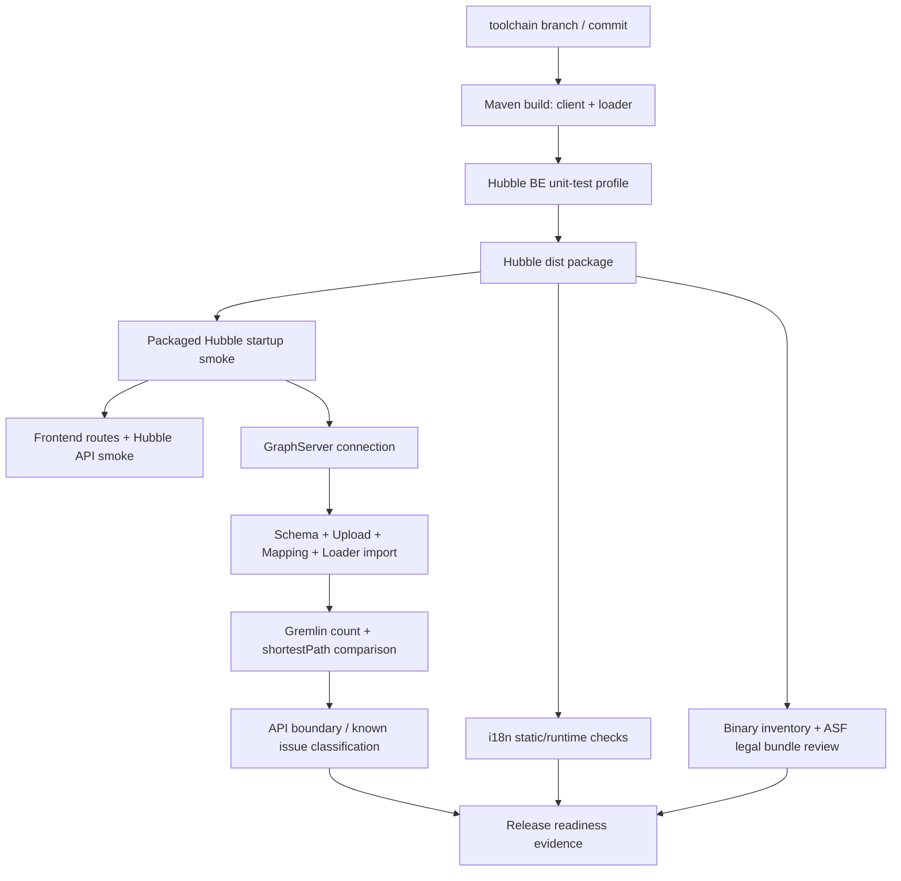
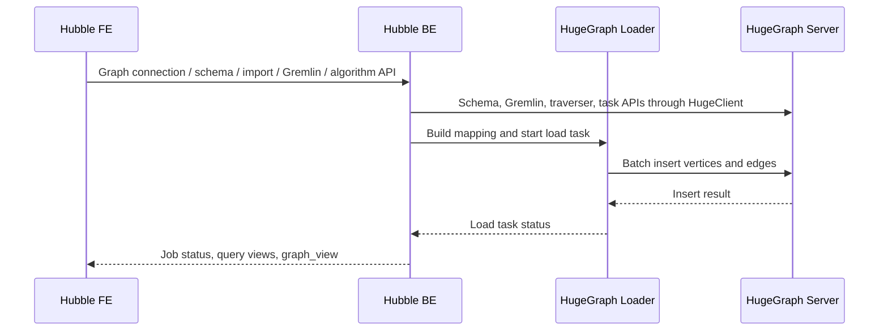

# 设计文档: Hubble V2 issue 694 验证与修复

## 1. 概述 (Overview)

### 1.1 目标 (Goals)

本设计把飞书 Wiki《Hubble V2.0 发版收尾任务拆分》及其 5 个子文档落地为
`hugegraph-toolchain` 仓库内可追踪的技术设计，用于修复和验证 GitHub issue
#694。设计目标是让 Hubble V2 的构建、启动、前后端集成、GraphServer/Loader
链路、i18n、binary 合规和 API 边界都有明确实现点和验证口径。

### 1.2 范围 (Scope)

**In-Scope**:

- Hubble BE 构建、单测 profile、核心 service/controller 轻量 bug 修复。
- Hubble FE 构建产物、核心路由、i18n 静态和运行态验证。
- Hubble dist 打包、启动脚本、Docker 前台运行、legal bundle、binary inventory。
- Hubble 到 GraphServer 的图连接、schema、Gremlin、shortestPath 验证。
- Hubble data import 到 HugeGraph Loader 再写入 GraphServer 的 smoke 流程。
- Server/API 缺口、产品边界和 known issue 的分类规则。

**Out-of-Scope**:

- 实现所有 FE 中出现但 Hubble BE 未暴露的算法 slug。
- 把 Server direct API 能力描述为 Hubble UI/backend 已支持能力。
- 把飞书文档中的历史执行结果当作当前分支 issue #694 的已验证事实。
- 使用未跟踪数据集、个人临时目录或旧 candidate 作为最终 review 证据。

### 1.3 关联需求 (Related Requirements)

- 构建与分发: U1, U2, E1, X1
- 运行与脚本: E2, E3, E4, X2
- 前后端集成: U3, E5, E6, X3
- GraphServer/Loader: E7, E8, E9, E10, X4
- API 边界: U4, U5, X5, X6
- i18n/binary: U6, U7, U8, E11, X7
- rules 工作流: U9, U10, U11, X8

## 2. 调研结论 (Research Findings)

### 2.1 飞书设计来源

设计来源为用户指定的飞书 Wiki：

- 父文档: `https://hugegraph.feishu.cn/wiki/GkluwBcEViwKRikppZochbognVd`
- Subtask 01: 编译确认与 Bug 收敛方案
- Subtask 02: 国际化与英文支持方案
- Subtask 03: OLTP / OLAP 功能验证方案
- Subtask 04: 二进制包 ASF 合规分类与 Hubble 打包审计方案
- Subtask 05: Server / API 欠缺确认方案

这些文档的核心设计不是“某次验证已经通过”，而是 release readiness 的 gate
体系：编译、启停、功能、i18n、binary、Server/API、known issue 都必须绑定正式
candidate、commit、命令和证据。

### 2.2 当前仓库依据

本地调研确认了以下实现入口：

| 域 | 仓库入口 |
|-|-|
| 图连接 | `hugegraph-hubble/hubble-be/src/main/java/org/apache/hugegraph/controller/GraphConnectionController.java` |
| 上传 | `hugegraph-hubble/hubble-be/src/main/java/org/apache/hugegraph/controller/load/FileUploadController.java` |
| 加载任务 | `hugegraph-hubble/hubble-be/src/main/java/org/apache/hugegraph/controller/load/LoadTaskController.java` |
| Gremlin | `hugegraph-hubble/hubble-be/src/main/java/org/apache/hugegraph/controller/query/GremlinQueryController.java` |
| shortestPath | `hugegraph-hubble/hubble-be/src/main/java/org/apache/hugegraph/controller/algorithm/OltpAlgoController.java` 和 `OltpAlgoService.java` |
| 异步任务 | `hugegraph-hubble/hubble-be/src/main/java/org/apache/hugegraph/controller/task/AsyncTaskController.java` |
| 上传白名单 | `hugegraph-hubble/hubble-be/src/main/java/org/apache/hugegraph/options/HubbleOptions.java` |
| FE build/dist | `hugegraph-hubble/hubble-dist/pom.xml` |
| binary assembly | `hugegraph-hubble/hubble-dist/assembly/descriptor/assembly.xml` |
| 启动脚本 | `hugegraph-hubble/hubble-dist/assembly/static/bin/start-hubble.sh` |

当前 `hubble-dist/pom.xml` 使用 `frontend-maven-plugin` 固定 Node `v16.20.2` 和 Yarn
`v1.22.21` 构建前端，再把 `hubble-fe/build` 拷贝为 candidate 的 `ui/`。当前
`assembly.xml` 负责打包 `bin`、`conf`、README、项目 jar、runtime dependency jar
以及来自 `hugegraph-dist/release-docs` 的 `LICENSE`、`NOTICE`、`licenses/**`。

## 3. 整体架构 (System Architecture)

### 3.1 验证与修复链路

### 3.2 运行时交互

## 4. 设计决策与权衡 (Design Decisions & Trade-offs)

### 4.1 以正式 candidate 为证据源

**决策**: 所有最终 review 证据必须绑定同一 branch/commit/candidate。

**理由**: issue #694 要求验证“新 Hubble 前后端模块”是否可构建、可启动、可通过
前端访问后端，并确认 GraphServer + GraphLoader。源码检查只能说明设计意图，不能
证明分发包里真实包含 `ui/`、legal 文件和正确脚本。

**权衡**: 验证脚本需要重复启动 Hubble/Server，成本高于单纯单测；但这是 release
readiness 所需的最低证据。

### 4.2 修复轻量阻塞问题，不扩大算法功能范围

**决策**: 本轮只修复阻塞构建、启动、上传、shortestPath graph view、binary
contents 等 issue #694 直接相关问题，不补齐所有非 shortestPath 算法后端接口。

**理由**: 飞书 Subtask 03/05 明确将非 shortestPath 算法 slug 的 405 归为
Hubble UI/API integration gap 或产品边界项。补齐所有算法会扩大范围，且需要新的
需求、设计和完整验证。

**权衡**: 最终 release note 需要明确“已验证算法 API 范围为 shortestPath”，不能
宣称所有算法都支持。

### 4.3 把 Server direct 能力和 Hubble 支持能力分开

**决策**: 所有失败点必须做 Hubble API 与 direct Server 对比，并分别归因为
Hubble、Server、配置、数据或产品边界。

**理由**: Hubble 是 Graph-UI/backend orchestration，不是 Server API 本身。
Server direct smoke 只能证明 Server 能力，不能替代 Hubble UI/backend 支持。

### 4.4 binary 合规检查从 tarball 出发

**决策**: binary inventory 必须从最终 `.tar.gz` 解包或 `tar tzf` 结果生成，不能从
已运行过的展开目录统计。

**理由**: 展开目录会产生 `logs/`、pid、H2 db、upload-files 等运行残留；这些文件
如果出现在 tarball 中才是 blocker。

## 5. API 接口设计 (API Design)

本轮不新增公开 API，主要校正和验证现有 Hubble API 行为。

### `POST /api/v1.2/graph-connections/{connId}/algorithms/shortestPath`

### `POST /api/v1.2/graph-connections/{connId}/algorithms/shortpath`

- **描述**: 通过 Hubble 调用 Server traverser shortestPath，并返回
  `jsonView`、`tableView`、`graphView`。`shortestPath` 是后端 canonical endpoint，
  `shortpath` 是 Hubble FE 当前 shortest-path 页面实际使用的兼容 alias。
- **设计要求**:
  - `jsonView` 保留 Server path 结果。
  - `tableView` 展示 path 中顶点/边 id。
  - `graphView` 必须包含 path 中可回查的顶点和边。
  - graph view 回填失败时，应避免误把 Server path 结果整体判定失败，除非核心
    API 语义已无法满足。
  - API boundary inventory 必须继续证明 FE 16 个 algorithm 中当前只有
    shortest-path 由 Hubble BE 支持，其余算法 slug 不得被描述为已实现。

### `/api/v1.2/graph-connections/{connId}/job-manager/**`

- **描述**: 支撑数据导入 job、上传 token、上传文件、阶段推进和 job 状态查询。
- **设计要求**:
  - 上传格式白名单覆盖 issue 验证数据所需格式。
  - job 与 load task 状态必须在查询路径上保持可理解的一致性。
  - 上传、mapping、load 的验证证据必须记录 job id、task id、最终状态和计数。

### `/api/v1.2/graph-connections/{connId}/gremlin-query`

- **描述**: 支撑 Gremlin 查询和 json/table/graph 视图。
- **设计要求**:
  - Vertex/Edge/Path 类型应验证 graph view。
  - scalar/general 结果不强制要求 graph view。
  - Hubble 与 direct Server 都失败时，进入 Server/API 归因矩阵。

## 6. 核心逻辑实现 (Core Logic)

### 6.1 构建与打包

1. 按 Maven 多模块依赖顺序构建 `hugegraph-client`、`hugegraph-loader`。
2. 运行 Hubble BE unit-test profile，确保不误跑需要外部 Server 的 API/func tests。
3. 使用 `hubble-dist/pom.xml` 的 frontend-maven-plugin 构建 FE，并生成 dist。
4. 使用 assembly 和 antrun 产出 `apache-hugegraph-hubble-<version>.tar.gz`。
5. 产物必须包含 `bin`、`conf`、`lib`、`ui`、README、LICENSE、NOTICE、`licenses`。

### 6.2 运行与容器启动

1. `start-hubble.sh` 支持后台启动和 `-f` 前台启动。
2. Docker entrypoint 使用前台模式，保持容器主进程生命周期。
3. runtime smoke 只使用 candidate 内脚本，不用源码目录 shortcut。
4. health 和 `/` UI root 是最低启动 gate。

### 6.3 shortestPath graph view

1. Hubble 调用 Server traverser shortestPath。
2. 从返回 path 中识别顶点和边，或从可用 id 回填实际对象。
3. 组装 `GraphView(vertices, edges)`。
4. 通过单测覆盖 path edge 保留、缺失字段 fallback、空路径和回填失败降级。

### 6.4 i18n

1. 静态检查 `zh-CN` 与 `en-US` key 对称。
2. 检查空值、TODO/TBD/xxx、英文资源残留中文、raw key 风险。
3. 对核心路由做浏览器运行态验证和语言切换验证。
4. Server 原文错误不自动归为 i18n bug，但需要写清 release 口径。

### 6.5 binary inventory

1. 从最终 tarball 读取根目录结构。
2. 检查 runtime residue、Node/Yarn runtime/cache、`node_modules`、source maps。
3. 检查 `lib/*.jar`、native-in-jar、unknown binary、archives。
4. 对 `LICENSE`、`NOTICE`、`licenses/**` 做存在性和覆盖性检查。

## 7. 非功能性需求 (Non-Functional Requirements)

- **可复现性**: 每个 gate 必须记录完整命令、commit/candidate 和关键输出摘要。
- **最小变更**: 修复应局限于 Hubble issue #694 直接相关路径，避免大规模重构。
- **发布合规**: candidate 不得包含凭据、个人路径、运行残留或不可解释二进制。
- **证据边界**: 历史飞书验证结果只能作为设计参考，当前分支必须重新生成证据。
- **安全**: 文档和日志不得包含 token、账号密码或私有环境凭据。

## 8. 测试策略 (Testing Strategy)

| 层级 | 命令 / 方法 | 覆盖 |
|-|-|-|
| BE unit | `mvn test -P unit-test -pl hugegraph-hubble/hubble-be -ntp` | shortestPath、上传白名单、job/load 状态等局部逻辑 |
| Package | `cd hugegraph-hubble && mvn package -DskipTests -Dmaven.javadoc.skip=true -ntp` | FE build、dist、assembly、tarball |
| Runtime smoke | `bin/start-hubble.sh` + health + `/` + stop | candidate 启停和 UI root |
| i18n static | Node 脚本检查 i18n resources | key 对称、空值、raw key 风险 |
| Binary audit | shell 脚本检查 tarball | 结构、legal、残留、Node 缓存、未知二进制 |
| Live integration | Hubble + local HugeGraph Server + Loader flow | graph connection、schema、upload、import、Gremlin、shortestPath |
| Browser smoke | Playwright 或等价浏览器工具 | 核心路由、网络请求、截图、运行态 i18n |

## 9. 风险与缓解措施 (Risks & Mitigation)

| 风险 | 缓解 |
|-|-|
| 本地无可用 HugeGraph Server 或 Docker | 标记 GraphServer/Loader gate 未完成，保留命令，不声明 issue 完全解决 |
| FE 构建依赖 Node 版本 | 使用 `hubble-dist/pom.xml` 固定的 Node/Yarn，不使用系统 Node 作为唯一证据 |
| Hubble route fallback 被误判为集成通过 | 浏览器验证必须记录实际 Hubble API 请求或 backend snapshot |
| 非 shortestPath 算法被误宣称支持 | release note 明确算法 API verified scope；405 进入 API boundary 矩阵 |
| 运行后展开目录产生 residue | binary audit 只对最终 tarball 下结论 |
| 飞书历史结果污染当前结论 | 本仓库执行日志只记录当前分支、当前 candidate 的命令和结果 |

## 10. 出口条件 (Exit Criteria)

- `requirements.md`、`design.md`、`tasks.md` 均存在并经用户批准。
- `tasks.md` 中每个实现任务都有需求 ID、依赖和验证方式。
- 实现执行日志记录每个任务的命令、结果、失败和未完成 gate。
- issue #694 的 build、runtime、frontend/backend、GraphServer/Loader、i18n、
  binary、API boundary gate 均有当前 candidate 证据，或明确标注未完成原因。
