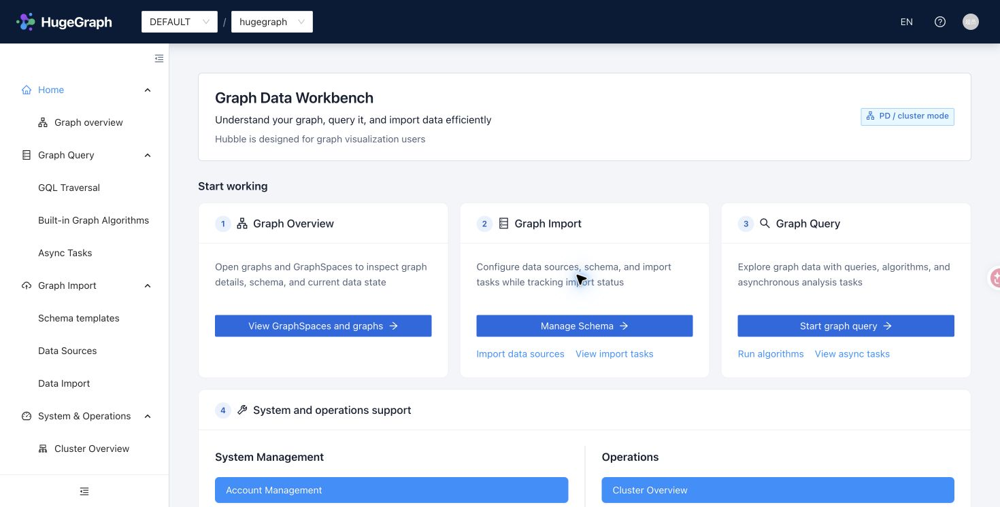
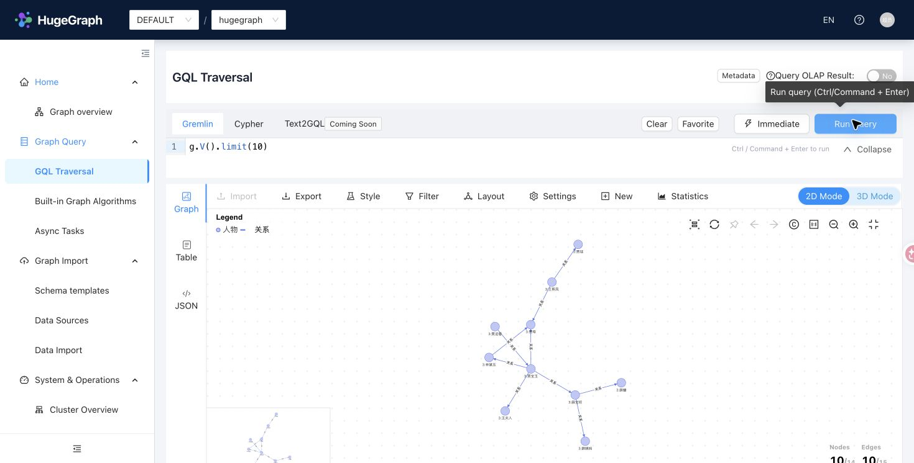
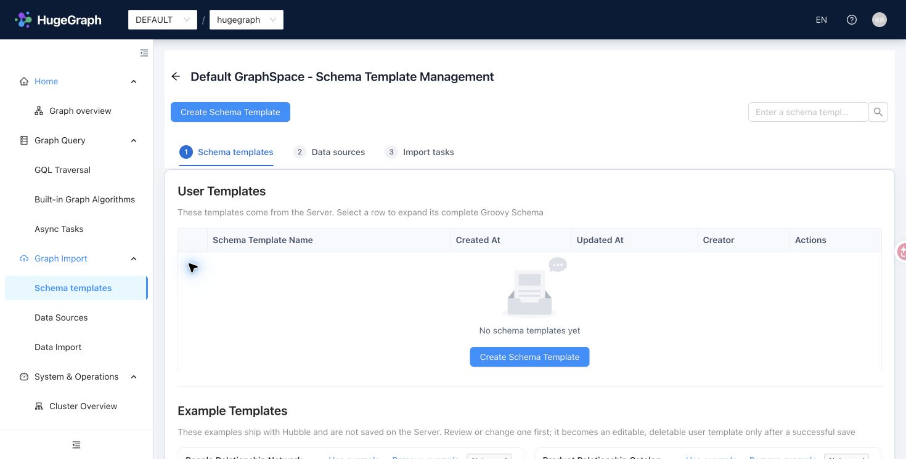
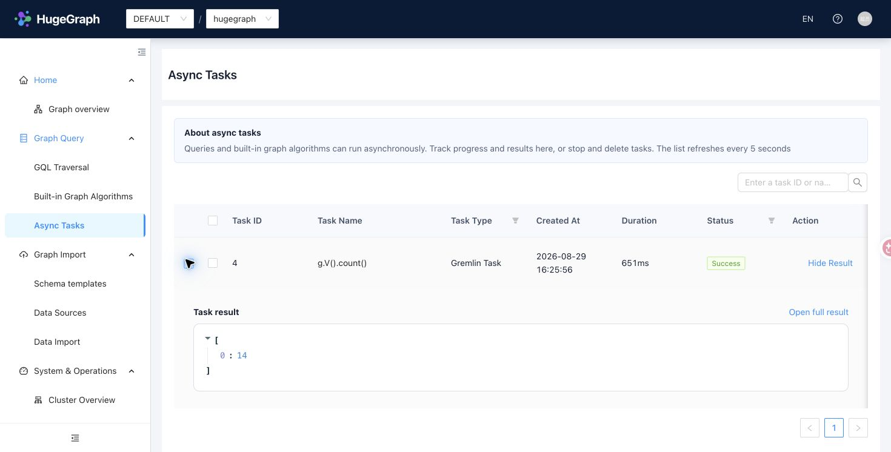
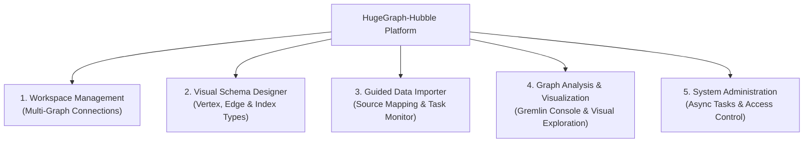

# Apache HugeGraph-Hubble

[](https://www.apache.org/licenses/LICENSE-2.0.html)
[](https://github.com/apache/hugegraph-toolchain/actions/workflows/hubble-ci.yml)
[](https://github.com/apache/hugegraph-toolchain/actions/workflows/codeql-analysis.yml)

hugegraph-hubble is a graph management and analysis platform that provides features:
graph data load, schema management, graph relationship analysis, and graphical display.

## Product Tour

### Graph Data Workbench

Start from one workspace for graph discovery, import, query, account management, and cluster operations.



### GQL Traversal

Run Gremlin queries and inspect their graph, table, or JSON results without leaving the workbench.



### Schema Templates

Prepare reusable schemas before configuring data sources and import tasks.



### Asynchronous Tasks

Track asynchronous queries and algorithms, then expand compact results inline.



## Authentication, connections, and compatibility

Hubble uses one capability-driven connection boundary for `1.8/master`. Authentication mode is detected from the connected HugeGraph Server; Hubble does not maintain a separate authentication switch. Account and permission entry points are hidden when Server allows anonymous access. Connection switching always goes through the backend resolver. In PD mode, a valid server address returned by discovery is sufficient; a manually configured server URL is not required.

The UI presents four stable permission meanings: super administrator, GraphSpace read-only, GraphSpace read-write, and GraphSpace administrator. The last one means member management plus read/write within that GraphSpace; low-level `role`, `target`, `access`, and `belong` fields are not exposed.

The compatibility boundary is deliberately small:

| HugeGraph Server / PD | Deployment | Hubble compatibility | Scope and limitations |
|---|---|---|---|
| Server 1.5.x | Standalone, normally without authentication | Minimum compatibility | Basic graph, schema, data, and Gremlin workflows only. GraphSpace, account permissions, PD/Store topology, cluster operations, and newer algorithms are unavailable. |
| Server 1.7.x with matching PD/Store 1.7.x | Standalone or distributed | Minimum compatibility through legacy adapters | Core management and query workflows remain usable, but legacy REST/Gremlin authentication, permission semantics, metrics, and algorithm capabilities may provide a reduced experience. |
| Server, PD, and Store 1.8.x or later | Distributed deployment recommended | Full and recommended experience | Current GraphSpace, account permission presets, cluster operations, async tasks, and algorithm capability handling are designed and validated against this generation. |

Use matching Server, PD, and Store minor versions in a distributed cluster. **Server/PD 1.8 or later is strongly recommended for the best Hubble experience.** Support for 1.5 and 1.7 is intentionally limited to minimum usability and does not imply feature parity with the current release. Version checks stay in the client adapter/resolver rather than being scattered through controllers or pages. See [`AGENTS.md`](AGENTS.md) for verification rules.

## Local development feedback loop

Run the frontend with third-party source-map noise disabled:

```bash
cd hubble-fe
yarn dev
```

Run the backend incrementally with Java 17 and the Maven daemon:

```bash
export JAVA_HOME=$(/usr/libexec/java_home -v 17)
mvnd -pl hubble-be -DskipTests compile dependency:build-classpath \
  -Dmdep.outputFile=/tmp/hubble-be-classpath
mkdir -p /tmp/hubble-dev-home
cd hubble-be
"$JAVA_HOME/bin/java" -Dfile.encoding=UTF-8 \
  --add-opens=java.base/java.net=ALL-UNNAMED \
  -Dhubble.home.path=/tmp/hubble-dev-home \
  -cp "target/classes:$(</tmp/hubble-be-classpath)" \
  org.apache.hugegraph.HugeGraphHubble
```

Stop the previous backend process before restarting after Java changes. Changes
under `hubble-be/src/main/resources` are copied by the next `compile`. The POM
does not configure `spring-boot:run`, so that command is not a supported local
shortcut. Build
the release package with `mvnd package -DskipTests`; these development commands
do not change packaged runtime behavior.

Native Store metrics use an operator-managed exact-origin allowlist in addition
to PD topology and metrics-target discovery. The packaged default
`operations.store.allowed_targets=[http://127.0.0.1:8520,http://[::1]:8520]`
is only for local testing. Production deployments must explicitly list every
trusted Store scheme, hostname or literal address, and port; discovery cannot
add origins to this allowlist. HTTPS origins keep their configured hostname for
TLS SNI and certificate hostname verification.

## Functional Modules Overview



<details>
<summary>ASCII diagram (for terminals/editors)</summary>

```
             ┌──────────────────────────────────────────┐
             │       HugeGraph-Hubble Platform          │
             └────────────────────┬─────────────────────┘
                                  │
      ┌───────────────────────────┼───────────────────────────┐
      ▼                           ▼                           ▼
┌──────────────┐            ┌──────────────┐            ┌──────────────┐
│  Workspace   │            │Visual Schema │            │ Guided Data  │
│  Management  │            │   Designer   │            │   Importer   │
│  - Connect   │            │  - Vertex    │            │  - Sources   │
│  - Switch    │            │  - Edge      │            │  - Mapping   │
│  - Card View │            │  - Index     │            │  - Monitor   │
└──────────────┘            └──────────────┘            └──────────────┘
      │                                                       │
      └───────────────────────────┬───────────────────────────┘
                                  │
                                  ▼
                    ┌──────────────────────────┐
                    │Graph Analysis & Explorer │
                    │ - Gremlin Console        │
                    │ - Algorithm Execution    │
                    │ - Topology Exploration   │
                    └──────────────────────────┘
```
</details>

## Features

- Graph connection management, supporting to easily switch graph to operate
- Graph data load, supporting to load large amounts of data from files into hugegraph-server
- Schema management, supporting to easily perform schema manipulation and display
- Graph analysis and graphical display, supporting to build a query via the gremlin or algorithms with a little effort then will get cool graphical results

## Quick Start

There are three ways to get HugeGraph-Hubble:

- Download the Toolchain binary package
- Source code compilation
- Use Docker image (Convenient for Test/Dev)

And you can find more details in the [doc](https://hugegraph.apache.org/docs/quickstart/hugegraph-hubble/#2-deploy)

### 1. Download the Toolchain binary package

`hubble` is in the `toolchain` project. First, download the binary tar tarball

```bash
wget https://downloads.apache.org/hugegraph/{version}/apache-hugegraph-toolchain-{version}.tar.gz
tar -xvf apache-hugegraph-toolchain-{version}.tar.gz
cd apache-hugegraph-toolchain-{version}/apache-hugegraph-hubble-{version}
```

Run `hubble`:

```
bin/start-hubble.sh
```

Then use a web browser to access `ip:8088` and you can see the `Hubble` page. You can stop the service using bin/stop-hubble.sh.

### 2. Clone source code then compile and install

> Note: Compiling Hubble requires the user's local environment to have Node.js V18.20.8 and yarn installed.

```bash
apt install curl build-essential
curl -o- https://raw.githubusercontent.com/nvm-sh/nvm/v0.39.1/install.sh | bash
source ~/.bashrc
nvm install 18.20.8
```

Then, verify that the installed Node.js version is 18.20.8.

```bash
node -v
```

install `yarn` by the command below:

```bash
npm install -g yarn
```

Download the toolchain source code.

```bash
git clone https://github.com/apache/hugegraph-toolchain.git
```

For the Java 17 candidate, prepare the locked SDK using the [bootstrap instructions](../docs/java17-migration.md#build-the-locked-candidate). Build Client and Loader first, then Hubble with the same isolated Maven repository:

```bash
cd hugegraph-toolchain
python3 -m pip install -r hugegraph-hubble/hubble-dist/assembly/travis/requirements.txt
mvn -Dmaven.repo.local="$candidate_dir/m2" install -pl hugegraph-client,hugegraph-loader -am -Dmaven.javadoc.skip=true -DskipTests -ntp
(cd hugegraph-hubble && mvn -Dmaven.repo.local="$candidate_dir/m2" package -Dmaven.javadoc.skip=true -DskipTests -ntp)
cd hugegraph-hubble/apache-hugegraph-hubble-*
```

Run `hubble`

```bash
bin/start-hubble.sh -d
```

### 3. User docker image (Convenient for Test/Dev)

To build the current checkout, run from the Toolchain repository root:

```bash
docker build -f hugegraph-hubble/Dockerfile -t hugegraph/hugegraph-hubble:latest .
```

We can use `docker run -itd --name=hubble -p 8088:8088 hugegraph/hubble` to quickly start [hubble](https://hub.docker.com/r/hugegraph/hubble). An you can visit [hubble deploy doc](https://hugegraph.apache.org/docs/quickstart/hugegraph-hubble/#2-deploy) for more details.

Then we should follow the [hubble workflow doc](https://hugegraph.apache.org/docs/quickstart/hugegraph-hubble/#3platform-workflow) to create the graph.

> Note: 
> 1. The docker image of hugegraph-hubble is a convenience release, but not **official distribution** artifacts. You can find more details from [ASF Release Distribution Policy](https://infra.apache.org/release-distribution.html#dockerhub).
> 
> 2. Recommand to use `release tag`(like `1.0.0`) for the stable version. Use `latest` tag to experience the newest functions in development.

## Doc

[The hubble homepage](https://hugegraph.apache.org/docs/quickstart/hugegraph-hubble/) contains more information about it.

## License

hugegraph-hubble is licensed under Apache 2.0 License.

## Notice

The `hubble-fe` folder contains the frontend code, including all related source code for the frontend.

The `hubble-be` folder contains the backend code, including all related source code for the backend.

The `hubble-dist/assembly` folder contains distribution resources. Packaging the frontend and backend produces the deployment archive under `target/`.

## Runtime and metadata

Hubble 1.8 requires Java 17 and uses Spring Boot 3 with H2 2.x for metadata. MySQL remains available as a Loader source. When upgrading, use a new metadata database and retain the previous database with its matching Hubble release; automatic metadata migration is not supported. See [metadata storage](docs/metadata-storage.md) for configuration and troubleshooting.

The startup script includes `--add-opens=java.base/java.net=ALL-UNNAMED` for the embedded Loader's Hive ORC reader. Include this option when using a custom Java launch command. Packaged archives are generated under `target/` and exclude local runtime data.

## Graph switching

Query execution waits until the graph context matches the current route, including keyboard shortcuts during a graph switch. Standalone Server 1.5 supports core graph, schema and data operations; GraphSpace management and PD mode require a newer server.
