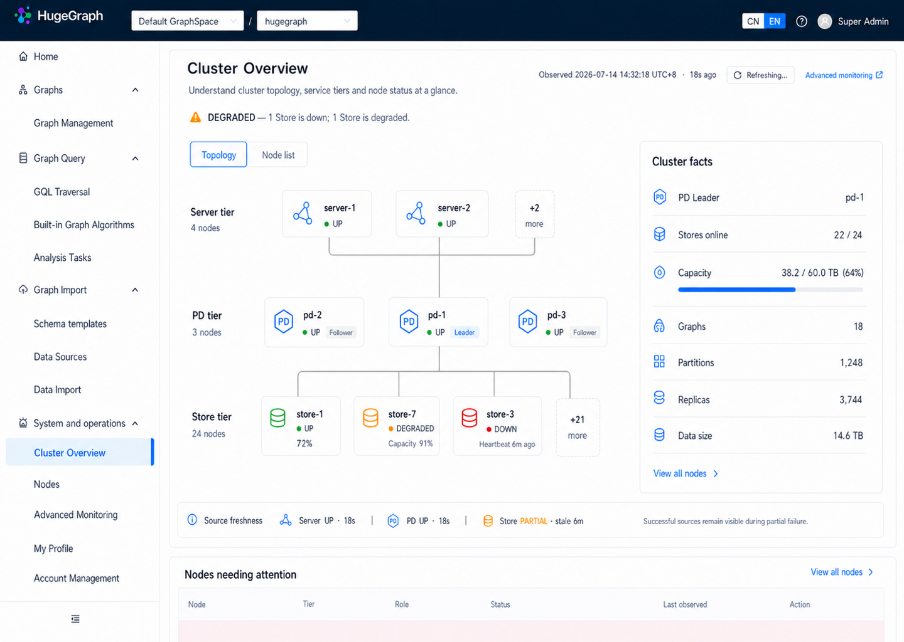

<!--
Licensed to the Apache Software Foundation (ASF) under one or more
contributor license agreements. See the NOTICE file distributed with this
work for additional information regarding copyright ownership. The ASF
licenses this file to You under the Apache License, Version 2.0 (the
"License"); you may not use this file except in compliance with the License.
You may obtain a copy of the License at

  http://www.apache.org/licenses/LICENSE-2.0

Unless required by applicable law or agreed to in writing, software
distributed under the License is distributed on an "AS IS" BASIS, WITHOUT
WARRANTIES OR CONDITIONS OF ANY KIND, either express or implied. See the
License for the specific language governing permissions and limitations
under the License.
-->

# Hubble 原生监控 UI/UX 方向

## 1. 文档状态

- 状态：已确认，作为当前无人值守 goal 的视觉、交互与验收基线。
- 确认日期：2026-07-14。
- 范围：Hubble 原生基础监控的集群概览、节点列表和节点详情。
- 本阶段交付：Cluster Overview、Nodes、Node Detail 前端实现与验证。
- 不在本阶段：告警规则编辑、通知渠道、历史时序存储、Grafana 替代。
- 事实源：HugeGraph Server、PD、Store 自身 API；Hubble Backend 是浏览器侧唯一聚合、鉴权、
  规范化和脱敏边界。

本文冻结的是 UI/UX 方向，不冻结未经多版本验证的 Backend API 字段。页面只能展示 Backend 已确认
可用、已授权并已规范化的数据。

## 2. 选定方案

选定“拓扑优先的集群工作台”方向，以三层图形化拓扑作为集群概览首屏的视觉核心：

```text
Server tier
     │
PD tier（主轴经过 PD Leader）
     │
Store tier
```

选择理由：

1. 相比指标卡或来源矩阵，三层拓扑能更快建立 Server、PD、Store 的整体心智模型。
2. 相比全量节点图，限制每层节点数量并使用 `+N` 聚合，可在 3、30、300 个节点时保持同一结构。
3. PD Leader、DOWN/DEGRADED 节点在图上优先出现，能把“整体结构”和“当前异常”放在同一视野。
4. 右侧 Cluster facts 保留容量、图、分区和副本等真实摘要；详细指标下沉到节点详情。
5. `Topology / Node list` 视角切换兼顾直观理解和大规模节点检索，不要求拓扑承担表格职责。
6. 视觉语言延续当前 Hubble 顶栏、侧栏、Ant Design 组件、品牌蓝、浅灰画布和低阴影表面。

未选择的方向及原因：

- 纵向诊断流：异常解释清晰，但首屏缺少集群结构的整体图像。
- Server / PD / Store 三列矩阵：来源比较高效，但更像通用运维控制台，弱化 HugeGraph 集群关系。
- 将拓扑改为三行服务表：扩展性强，但信息形态退化为表格，失去选定方案的直观性和视觉重心。

## 3. 最终视觉资产

仓库内权威资产：

- 相对路径：`hugegraph-hubble/docs/images/monitoring-cluster-overview-final-1440x1024.png`
- 当前 worktree 绝对路径：
  `/Users/imbajin/.codex/worktrees/hubble-monitoring-alerting-auth/toolchain/hugegraph-hubble/docs/images/monitoring-cluster-overview-final-1440x1024.png`
- 尺寸：`1440 x 1024` PNG。
- SHA-256：`d253efe3d725d43923ec9d9732ff67ba1fb78ca82bfd880b80da1d280b4def82`。

生成结果恢复引用：

- `/Users/imbajin/.codex/generated_images/019f5cd8-5b06-7252-ab4c-e23bbc466a3e/hubble-monitoring-final-tree-leader-graph-icon-1440x1024.png`

当前 goal 必须以仓库内图片的信息架构、组件语言和相对视觉层级为准。该图片的
`1440 x 1024` 是选型资产尺寸，不是实现的主视口或像素级验收尺寸；主设计与浏览器验收优先使用
`2560 x 1440` 和 `1920 x 1080`。生成目录只用于当前机器恢复，不能替代版本化资产。



## 4. 信息架构

```text
系统与运维
├── 集群概览
│   ├── 总体健康与观测时间
│   ├── Topology / Node list 视角切换
│   ├── Server / PD / Store 三层拓扑
│   ├── Cluster facts
│   ├── 来源新鲜度与部分失败
│   └── 需关注节点预览
├── 节点
│   ├── 全部节点
│   ├── Server
│   ├── PD
│   ├── Store
│   └── 节点详情
└── 高级监控
    └── 可选 Dashboard / Grafana 外链
```

Dashboard/Grafana 只作为“高级监控”次级入口。其未配置或不可用不能禁用集群概览、节点列表或节点
详情。

## 5. 主要用户旅程

### 5.1 快速判断集群状态

1. 用户进入集群概览。
2. 首先读取 `UP / DEGRADED / DOWN / UNKNOWN` 和简短原因。
3. 检查 observed time、refreshing、fresh/stale，确认数据是否仍有时效性。
4. 通过三层拓扑确认异常位于 Server、PD 还是 Store，并识别 PD Leader。
5. 通过右侧摘要确认容量、Store 在线数、图、分区和副本等当前值。

目标：正常网络下，用户应在 10 秒内回答“整体是否健康、哪个来源异常、数据有多新、下一步去哪”。

### 5.2 从拓扑进入节点详情

- 点击具体节点：进入该节点详情。
- 点击 `+N`：切换到 Node list 视角，并自动带入当前节点类型过滤。
- 点击某一 tier 的标题或 “View nodes”：进入完整 Nodes 页面并带入类型过滤。
- PD Leader 必须位于主视觉轴线上；Follower 作为侧支。
- Store 不存在已确认的单一集群 Leader 时，不得制造一个 Store Leader。

### 5.3 大规模节点排查

1. 用户切换至 Node list，或从 `+N` 进入。
2. 使用节点类型、状态、搜索、排序和分页缩小范围。
3. 行点击进入节点详情；不使用小弹窗承载全部指标。
4. 返回时恢复过滤、排序、分页和滚动位置。

### 5.4 高级监控

- 只有 Dashboard capability 可用且当前用户具备权限时，显示可用外链。
- 外链采用次级按钮或文本链接，并标识会打开外部页面。
- 外部监控不可用只影响该入口，不改变原生基础监控状态。

## 6. 集群概览布局规则

### 6.1 2560 × 1440 QHD 主基准

- 顶栏：64px，保留 HugeGraph 品牌、GraphSpace/Graph 上下文、语言、帮助和用户入口。
- 侧栏：248px，白色背景；`Cluster Overview` 使用现有品牌蓝选中态。
- 内容画布：`#f2f5f9`，使用 24-32px 页面边距，不因宽屏无节制拉长文字或节点卡。
- 顶部标题区保持紧凑，不使用横跨页面、包含大量空白的厚重 banner。
- 主体采用约 `2/3 + 1/3`：左侧拓扑，右侧 Cluster facts。
- 宽屏空间优先用于拉开拓扑分支、提高节点辨识度和保留完整事实摘要，不增加装饰指标或重复卡片。
- 来源 freshness 使用单行低高度信息条，不重复三张大型 Server/PD/Store 卡片。
- “Nodes needing attention” 位于首屏下缘或下一屏，避免挤压拓扑。

### 6.2 1920 × 1080 FHD 第二主基准

- 保持 `2/3 + 1/3` 结构，不隐藏总体状态、PD Leader、Store 在线数或 freshness。
- 拓扑、Cluster facts 和 freshness 应在首屏形成完整主任务；需关注节点允许自然进入下一屏。
- 文字不低于 12px，正文仍以 14px 为基准，不通过整体缩放模拟 QHD。
- Cluster facts 可收紧行高，但不得改成横向滚动。
- 节点卡内容优先级：名称、角色/状态、一个关键值；版本、地址等进入详情。

### 6.3 1440×900 / 1366×768 / 1280×720 较小桌面兼容

- 作为兼容回归而非主视觉基准；保持总体状态、PD Leader、Store 在线数、freshness 和主要操作可见。
- 允许缩小拓扑间距、把需关注节点移到下一屏，但不得产生页面级横向滚动或裁切关键状态。
- 不得为了适配较小桌面反向限制 QHD/FHD 的信息密度和空间利用。
- 最低支持视口为 `1280×720`；不要求适配移动端、768px 宽窄屏或任何低于 720p 的分辨率。

## 7. 拓扑表达规则

### 7.1 三层结构

- Server 位于顶部，使用蓝色简洁 node-link Graph 图标，不使用通用机架服务器图标。
- PD 位于中部，使用 PD 六边形图标；Leader 固定在中心主轴，Follower 位于侧支。
- Store 位于底部，使用数据库/存储圆柱图标。
- 连线是逻辑服务层关系，不表示真实网络流量、请求路径或物理部署。

### 7.2 节点选择与聚合

每个 tier 最多展示 3 个真实节点卡，额外节点使用一个较轻的 `+N` 聚合节点：

1. PD Leader 固定展示。
2. `DOWN` 和 `DEGRADED` 节点优先展示。
3. 剩余位置填充健康代表节点。
4. 其他节点聚合为 `+N`。

所有真实节点和 `+N` 都必须连接到当前 tier 的分支，不允许悬空。主竖线必须经过 PD Leader，并由
Leader 向 Store 分支延续；不得让 Follower 成为中心主轴。

节点卡只显示：类型图标、稳定名称、关键角色、明确状态，以及至多一个关键值。完整 endpoint、版本、
JVM、磁盘、Raft 和分区详情进入节点详情。

## 8. 视觉系统

### 8.1 颜色

| 用途 | 基础色 | 文本/可访问表达 |
| --- | --- | --- |
| 品牌与交互 | `#1769e0` | 链接、选中态、主要按钮 |
| 品牌强调 | `#0f56bd` | hover/focus 后的深色 |
| 主文字 | `#172033` | 标题和关键值 |
| 次级文字 | `#536179` | 描述、时间、帮助 |
| 三级文字 | `#7b879c` | 非关键元数据 |
| 画布 | `#f2f5f9` | 页面底色 |
| 表面 | `#ffffff` | 主内容表面 |
| 边框 | `#d8dee9` | 分隔和轻边框 |
| UP | `#52c41a` | 深色文字 `#237804` + check/实心圆 + `UP` |
| DEGRADED | `#faad14` | 深色文字 `#874d00` + warning + `DEGRADED` |
| DOWN | `#f5222d` | 深色文字 `#a8071a` + error + `DOWN` |
| UNKNOWN | `#8c8c8c` | 深色文字 `#595959` + question/空心圆 + `UNKNOWN` |

状态不能只靠颜色；必须同时使用图标或形状、文字和颜色。色彩用于定位，不替代语义。

### 8.2 排版

- 字体：沿用 Hubble 系统字体栈；不引入新的品牌字体。
- 页面标题：22px / 30px，600。
- 区块标题：16px / 24px，600。
- 正文和表格：14px / 22px，400-500。
- 元数据和辅助标签：12px / 20px；不得用于关键状态和主要操作。
- 数字使用一致的单位和本地化格式；未知值显示“不可用”，不显示 `0`、`NaN` 或 `undefined`。

### 8.3 间距与表面

- 间距基线：4、8、12、16、24、32px。
- 控件圆角：6px；大型表面圆角：10px。
- 优先使用间距、对齐、字号和分隔线组织层级。
- 只有独立对象使用卡片；禁止卡片套卡片和“一指标一卡片”。
- 阴影仅用于顶栏和主要浮层；普通内容以边框或背景差区分。
- 键盘焦点使用现有 `--workbench-focus-ring`，不能只依赖浏览器默认轮廓。

### 8.4 图表

- P0 只展示当前值、线性容量进度和结构拓扑。
- 没有可靠时间序列时，不显示折线、面积图、sparkline、趋势百分比或状态历史。
- 只有 Backend 提供真实时间序列、采样间隔、时间范围和缺口语义后才允许时序图。
- 所有图表必须提供文字摘要、单位、时间范围和无数据状态。

## 9. Overview、Node list、Node detail 的共同组件语言

### 9.1 `HealthStatus`

- 统一 `UP / DEGRADED / DOWN / UNKNOWN`。
- 由图标/形状、文本、色彩和可选原因组成。
- 不将 `partial`、`stale`、`unsupported` 错误映射为 `DOWN`。

### 9.2 `ObservedAt` / `Freshness`

- 同时支持绝对时间和相对时间，例如 `2026-07-14 14:32:18 UTC+8 · 18s ago`。
- `refreshing` 保留上次成功数据；显示刷新状态，不清空页面。
- `stale` 显示最近成功时间和过期原因。

### 9.3 `SourceStatus`

- Server、PD、Store 独立建模 availability、freshness、error reason 和 last success。
- Overview 使用一条紧凑 metadata strip；Node detail 可按指标组复用。
- 一个来源失败不能让其他来源数据消失。

### 9.4 `NodeIdentity`

- 由类型图标、稳定节点 ID/名称、角色和版本组成。
- Server 使用 node-link Graph 图标；PD 使用 PD 图标；Store 使用存储圆柱图标。
- 地址、路径和内部拓扑字段按 capability 脱敏。

### 9.5 `MetricDefinitionList`

- 当前值采用定义列表、表格或 Statistic，不为每个值建立独立卡片。
- 值必须包含单位、来源和观测时间；不支持的值明确标记 `Unsupported`。

### 9.6 `NodeTable`

- 支持类型、状态、关键词过滤，稳定排序和分页/虚拟化。
- 行点击或明确的 View details 进入详情。
- 状态、节点名称和最后观测时间在所有断点保持可见。

## 10. 页面状态合同

| 状态 | 必需表现 |
| --- | --- |
| loading | 首次进入使用与最终布局同构的 skeleton；不闪现旧用户或旧集群数据。 |
| refreshing | 保留当前成功数据，刷新控件显示 `Refreshing…`；防止重复刷新。 |
| empty | 说明未发现 Server/PD/Store 节点，提供配置或排查路径，不伪装为全 0。 |
| partial | 保留成功来源；明确失败来源、失败类别和最近成功时间。 |
| stale | 使用时钟/警告、`Stale` 文本、观测时间和最近成功时间，不冒充实时。 |
| 401 | 显示会话失效并进入重新登录流程；不描述为集群故障。 |
| 403 | 说明无权访问及所需 capability；不泄露被隐藏字段的值。 |
| timeout | 标识具体超时来源，保留其他来源并提供局部重试。 |
| unavailable | 标识具体来源不可达；不回显内部异常栈、凭据或不安全完整 URL。 |
| unsupported | 说明当前服务版本不支持该字段或指标；不使用 0 代替。 |
| malformed/unknown | 安全降级为 UNKNOWN/不可用，记录诊断，不渲染 `undefined`/`NaN`。 |

卡片级状态与页面级状态分离。节点详情中 system、drive、raft、backend 等指标组必须能独立 loading、
error、unsupported 和 stale。

## 11. 角色与权限反馈

前端必须根据 Backend 返回的稳定 capabilities/permissions 渲染；以下角色只是默认展示预期，角色名
本身不是安全边界。

### 11.1 SUPERADMIN

- 具备相应 capability 时展示全局健康、完整拓扑、节点角色、版本、容量、磁盘、Raft 和 Backend 指标。
- 可见完整 Nodes 页面和节点详情，但秘密、凭据、内部异常栈仍不得返回。
- 高级监控入口由独立 Dashboard capability 控制。

### 11.2 SPACEADMIN

- 默认只展示被授权 GraphSpace 范围内的图级摘要和经过脱敏的健康信息。
- 不因管理某个 GraphSpace 自动获得全局节点、内部地址、磁盘、Raft 或全部容量信息。
- 有 `operations_health_read` 但无 topology/metrics 权限时，拓扑退化为 Server/PD/Store 类型级健康，
  不展示节点名称和内部结构。
- 缺少 capability 时显示明确的 403/受限说明，不用空白或通用加载失败代替。

### 11.3 普通用户

- 默认不显示全局运维导航和内部拓扑。
- 若 Backend 明确授予空间级健康能力，只显示授权范围内的脱敏摘要。
- 直接访问受保护 URL 必须经过 route guard，Backend 仍需返回 403。

字段裁剪后必须保持布局稳定。被禁止字段不留“神秘空洞”，可用简短的受限说明替代；不得通过字段
标题、tooltip、DOM 或网络响应泄露敏感值。

## 12. Must / Must-not

### Must

- 使用 Server、PD、Store 真实 API 经 Hubble Backend 规范化后的数据。
- 总体状态和各来源状态同时使用文字、图形和颜色。
- 显示 observed time、freshness、stale、refreshing 和 partial failure。
- PD Leader 位于拓扑主轴；所有可见节点和 `+N` 聚合节点都有完整连接。
- 每个 tier 最多显示 3 个真实节点；异常节点优先，剩余节点聚合。
- 保留成功来源和旧的成功数据，刷新或部分失败时不清空整页。
- 支持从拓扑、`+N`、节点预览进入过滤后的 Node list 或 Node detail。
- 按 capability 进行入口、字段、操作和路由反馈。
- 优先在 2560×1440 和 1920×1080 真实浏览器中完成视觉与交互验收；1440×900、1366×768 和
  1280×720 只作较小桌面兼容回归，不验收低于 720p 的分辨率或移动端布局。
- Dashboard/Grafana 始终是次级高级入口。

### Must-not

- 不虚构告警、事故、健康分数、趋势或实时性。
- 不生成没有真实历史数据的曲线、sparkline、热力图或状态时间线。
- 不把未知、缺失或 unsupported 渲染为 0。
- 不把 Dashboard availability 作为原生监控可用性的总开关。
- 不让 Hubble FE 直连 PD、Store 或内部监控端口。
- 不使用 Hubble 超级身份绕过当前用户的 Server `metrics_read` 权限。
- 不在浏览器响应、DOM、日志、截图或错误中暴露凭据、路径、内部异常栈或不必要的完整地址。
- 不把拓扑画成无限展开的全节点网络，也不把选定的图形拓扑退化为三行表格。
- 不制造单一 Store Leader、物理网络流量或未经上游证明的关系。
- 不使用大型重复 Server/PD/Store 状态卡；overview 使用紧凑 freshness strip。

## 13. 后续无人值守 goal 验收条件

以下条件必须全部满足，才能声明监控 UI/UX 实现完成：

1. 仓库内 1440×1024 选型资产仍存在且哈希一致；页面遵循其信息层级和组件语言，但不以该尺寸作
   像素级主验收。
2. Cluster Overview、Nodes、Node Detail 均为 Hubble 原生路由，不依赖 Dashboard/Grafana。
3. 拓扑在 3、30、300 节点夹具下保持相同三层结构；每层真实节点不超过 3 个，其余为 `+N`。
4. PD Leader 始终位于中心主轴；Leader 切换后位置和标签正确更新；Follower 不承载主轴。
5. Server、PD、Store 逐个不可达和单个 Store 不可达时，页面保留成功来源并准确显示 partial/stale。
6. loading、refreshing、empty、partial、stale、401、403、timeout、unsupported、malformed/unknown
   均有自动化测试和真实浏览器证据。
7. SUPERADMIN、SPACEADMIN、普通用户使用 Backend capabilities 验证入口、字段裁剪、直接 URL 和
   403 反馈；前端角色判断不替代 Backend 授权。
8. 节点列表具备类型/状态过滤、搜索、排序、分页或虚拟化；返回后恢复用户上下文。
9. 节点详情的 common、system、drive、raft、backend 指标组独立处理 loading/error/unsupported/stale。
10. 2560×1440 和 1920×1080 完成主视觉、信息密度和交互验收；1440×900、1366×768 和 1280×720
    完成最低桌面兼容，所有受支持视口均无页面级横向滚动、文字裁切或关键状态不可见，且键盘焦点
    和读屏名称可用；低于 720p 和移动端明确不在范围内。
11. 所有状态通过图标/形状、文字和颜色表达；对比度、reduced motion 和图表替代摘要通过检查。
12. 页面不包含假历史、假实时、虚构告警、装饰指标或没有来源的 0 值。
13. Dashboard 未配置、不可用和 popup blocked 只影响高级监控入口。
14. FE 定向测试、lint、i18n、production build 和适用的 BE 测试通过。
15. 使用真实最小 PD/Store/Server 环境完成 SUPERADMIN、受限角色、部分失败和最低 1280×720
    桌面分辨率浏览器矩阵。
16. 最终整体 diff 由未参与实现的只读 reviewer 复审；actionable finding 修复后完成复审。

## 14. 外部参考及借鉴边界

- [CockroachDB Cluster Overview](https://www.cockroachlabs.com/docs/stable/ui-cluster-overview-page)：借鉴将
  集群健康、容量和节点下钻分层组织的策略。
- [Grafana Status History](https://grafana.com/docs/grafana/latest/visualizations/panels-visualizations/visualizations/status-history/)：
  只在存在真实周期状态数据时使用历史状态图；当前 P0 不制造历史可视化。

只借鉴信息层级、状态表达和交互策略，不复制第三方品牌、页面结构或受保护资产。
